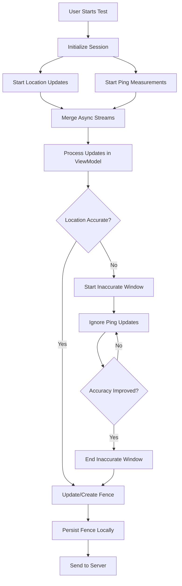

# Software Design Document: Network Coverage Feature

## Table of Contents
1. [Overview](#1-overview)
2. [Architecture](#2-architecture)
3. [Data Models](#3-data-models)
4. [Service Layer](#4-service-layer)
5. [User Interface](#5-user-interface)
6. [Data Flow](#6-data-flow)
7. [External Dependencies](#7-external-dependencies)
8. [Testing Strategy](#8-testing-strategy)
9. [Security Considerations](#9-security-considerations)
10. [Performance Optimizations](#10-performance-optimizations)
11. [Future Enhancements](#11-future-enhancements)

---

## 1. Overview

### 1.1 Purpose
The Network Coverage feature provides real-time network quality measurement across geographic areas, enabling users to map cellular network performance while moving through different locations. The system continuously measures network latency and associates it with precise GPS coordinates to build a comprehensive coverage map.

### 1.2 Scope
This document covers the iOS implementation of the Network Coverage feature within the Open-RMBT application, including:
- Real-time GPS tracking and network measurement
- Geographic fence-based data organization
- Local data persistence and server synchronization
- SwiftUI-based user interface with interactive mapping

### 1.3 Key Features
- **Continuous Measurement**: Automated network latency testing while user moves
- **Geographic Fencing**: Intelligent grouping of measurements by location (20m radius)
- **Real-time Visualization**: Interactive map display with technology overlays
- **Data Persistence**: Local storage with automatic server synchronization
- **Privacy-First**: Location data processed locally with minimal server transmission

---

## 2. Architecture

### 2.1 Overall Architecture Pattern
The Network Coverage feature follows a **MVVM (Model-View-ViewModel)** architecture enhanced with modern Swift patterns:

```
┌─────────────────┐    ┌──────────────────┐    ┌─────────────────┐
│   SwiftUI View  │◄───│   ViewModel      │◄───│  Service Layer  │
│                 │    │  (@Observable)   │    │   (Protocols)   │
└─────────────────┘    └──────────────────┘    └─────────────────┘
                                ▲                        ▲
                                │                        │
                       ┌─────────────────┐    ┌─────────────────┐
                       │   Domain        │    │  Infrastructure │
                       │   Models        │    │   Services      │
                       └─────────────────┘    └─────────────────┘
```

### 2.2 Design Patterns

#### 2.2.1 Dependency Injection
- **Factory Pattern**: `NetworkCoverageFactory` creates configured service instances
- **Protocol-Oriented**: Services defined by protocols for testability and flexibility
- **Runtime Configuration**: Dependencies injected through closures for dynamic behavior

#### 2.2.2 Reactive Programming
- **AsyncSequence**: Streams of location updates and network measurements
- **Async/Await**: Modern Swift concurrency for non-blocking operations
- **Observer Pattern**: SwiftUI `@Observable` for UI state management

#### 2.2.3 Domain-Driven Design
- **Service Layer**: Business logic encapsulated in focused service protocols
- **Domain Models**: Rich models (`Fence`) containing business rules
- **Repository Pattern**: Data access abstraction through persistence services

### 2.3 Module Structure
```
NetworkCoverage/
├── Components/               # Reusable UI components
├── CoverageMeasurementSession/ # Session management
├── CurrentRadioTechnology/   # Cellular tech detection
├── Helpers/                 # Utility functions
├── LocationUpdates/         # GPS tracking services
├── Persistence/             # Data storage layer
├── Pings/                   # Network measurement
├── SendResult/              # Server communication
├── NetworkCoverageView.swift     # Main UI
├── NetworkCoverageViewModel.swift # Business logic
├── NetworkCoverageFactory.swift  # DI container
└── Fence.swift             # Core domain model
```

---

## 3. Data Models

### 3.1 Core Domain Models

#### 3.1.1 Fence
The primary domain model representing a geographic area with network measurements:

```swift
struct Fence {
    let id: UUID
    let startingLocation: CLLocation
    let dateEntered: Date
    var dateExited: Date?
    var pings: [PingResult]
    var technologies: [String]

    // Computed properties
    var coordinate: CLLocationCoordinate2D
    /// Average latency in milliseconds
    var averagePing: Int?
}
```

**Business Rules:**
- Geographic radius: 20 meters (configurable)
- Maximum duration: 4 hours (auto-complete)
- Minimum ping samples: 1 for validity
- Location accuracy requirement: configurable. Production default 2 meters (read-only preview uses 10m)

#### 3.1.2 PingResult
Network latency measurement with temporal context:

```swift
struct PingResult {
    let result: PingMeasurementResult
    let timestamp: Date

    enum PingMeasurementResult {
        case interval(Duration)
        case error
    }
}
```

#### 3.1.3 LocationUpdate
GPS position data with measurement context:

```swift
struct LocationUpdate {
    let location: CLLocation
    let timestamp: Date
    
    var coordinate: CLLocationCoordinate2D
    var horizontalAccuracy: CLLocationAccuracy
}
```

### 3.2 Persistence Models

#### 3.2.1 PersistentFence
SwiftData model for local storage:

```swift
@Model
final class PersistentFence {
    var timestamp: UInt64            // dateEntered in microseconds since epoch
    var latitude: Double
    var longitude: Double
    var avgPingMilliseconds: Int?    // average latency in ms
    var technology: String?
    var testUUID: String
}
```

### 3.3 API Models

#### 3.3.1 SendCoverageResultRequest
Server communication payload:

```swift
class SendCoverageResultRequest: BasicRequest {
    var fences: [CoverageFence]
    var testUUID: String
    var clientUUID: String?

    class CoverageFence: Mappable {
        var timestampMicroseconds: UInt64
        var location: Location // latitude, longitude
        var avgPingMilliseconds: Int?
        var offsetMs: Int
        var durationMs: Int?
        var technology: String?     // radio access technology code
        var technologyId: Int?      // internal tech ID
    }
}
```

---

## 4. Service Layer

### 4.1 Service Architecture

The service layer implements a **protocol-first approach** enabling dependency injection and comprehensive testing:

```
Service Protocols          Implementations
├── LocationUpdatesService ─→ RealLocationUpdatesService
├── PingMeasurementService ─→ UDPPingSession (Actor)
├── RadioTechnologyService ─→ CTTelephonyRadioTechnologyService
├── FencePersistenceService─→ SwiftDataFencePersistenceService  
└── SendCoverageResults   ─→ ControlServerCoverageResultsService
```

### 4.2 Core Services

#### 4.2.1 LocationUpdatesService
**Purpose**: Continuous GPS tracking with accuracy filtering
**Protocol**:
```swift
@rethrows protocol LocationsAsyncSequence: AsyncSequence where Element == LocationUpdate { }
protocol LocationUpdatesService<Sequence> {
    associatedtype Sequence: LocationsAsyncSequence
    func locations() -> Sequence
}
```
**Implementation Details**:
- Uses Core Location’s `CLLocationUpdate.liveUpdates(...)` (iOS 17+)
- Filters updates by app state (only when measurement session is initialized)
- Emits `LocationUpdate` with precise timestamping
- Permission management handled at app level

#### 4.2.2 PingMeasurementService
**Purpose**: Network latency measurement using RTR protocol
**API shape**:
```swift
struct PingMeasurementService {
    static func pings2<T>(
        clock: some Clock<Duration>,
        pingSender: some PingSending<T>,
        now: @escaping () -> Date = Date.init,
        frequency: Duration
    ) -> some AsyncSequence<PingResult>
}
```
**Implementation Details**:
- UDP-based ping over `UDPPingSession` actor (RTR protocol)
- Configurable ping intervals (100 ms production default)
- Graceful handling of timeouts/errors (`.error` result)
- Session credentials obtained via control server initializer
- Optional HTTP fallback sender available for testing

#### 4.2.3 CurrentRadioTechnologyService
**Purpose**: Cellular network technology detection (3G/4G/5G)
**Protocol**:
```swift
protocol CurrentRadioTechnologyService {
    func technologyCode() -> String?
}
```
**Implementation Details**:
- Uses Core Telephony framework
- Maps internal technology codes to user-friendly strings
- Handles multiple SIM cards and carrier switching

#### 4.2.4 FencePersistenceService
**Purpose**: Local write-through of completed fences
**Protocol**:
```swift
protocol FencePersistenceService {
    func save(_ fence: Fence) throws
}
```
**Implementation Details**:
- SwiftData-based persistence using `ModelContext`
- Unsent loading and resend handled by dedicated services (below)

#### 4.2.5 SendCoverageResultsService
**Purpose**: Server communication and data synchronization
**Protocol**:
```swift
protocol SendCoverageResultsService {
    func send(fences: [Fence]) async throws
}
```
**Implementation Details**:
- Integration with existing `RMBTControlServer`
- ObjectMapper-based JSON serialization
- Reliability handled via persistence + resend (no exponential backoff yet)
- Invoked on test stop; persisted resend triggered on session start

### 4.3 Advanced Services

#### 4.3.1 PersistedFencesResender
**Purpose**: Reliability layer for network failures
- Deletes stale data beyond max age (default 7 days)
- Resends remaining persisted fences grouped by `testUUID`
- Deletes successfully sent records
- Ignores errors during resend (non-blocking)

#### 4.3.2 CoverageMeasurementSession
**Purpose**: Session lifecycle management
- Initializes measurement credentials
- Manages UDP session authentication
- Handles session timeouts and renewals

---

## 5. User Interface

### 5.1 UI Architecture

The user interface is built using **SwiftUI** with a reactive data binding approach:

```
NetworkCoverageView (SwiftUI)
├── MapKit Integration
│   ├── Fence Visualization (Circles + Annotations)
│   ├── User Location Tracking
│   └── Technology Color Coding
├── Control Panel
│   ├── Technology Display
│   ├── Ping Metrics
│   ├── Location Accuracy
│   └── Start/Stop Controls
├── Settings Panel
│   ├── Expert Mode Toggle
│   ├── Fence Radius Slider
│   └── Accuracy Threshold
└── Modal Components
    ├── Start Test Popup
    ├── Stop Test Popup  
    └── Results View
```

### 5.2 Key UI Components

#### 5.2.1 Main Coverage View
- **Interactive Map**: Real-time fence visualization with MapKit
- **Technology Overlay**: Color-coded circles indicating network type
- **Control Bar**: Current technology, ping, and location accuracy display
- **Navigation**: Full-screen modal with close functionality

#### 5.2.2 Fence Visualization
- **Geographic Circles**: 20m radius circles showing measurement areas
- **Color Coding**: Technology-specific colors (3G/4G/5G)
- **Selection State**: Visual feedback for selected fences
- **Expert Mode**: Additional technical details and GPS accuracy circles

#### 5.2.3 Modal Popups
- **Generic TestPopup**: Shared component for start/stop confirmations
- **Configurable Buttons**: Primary/secondary actions with custom styling
- **Mandatory Interaction**: No background dismissal, button-only navigation
- **Animation**: Smooth transitions with bottom sheet presentation

#### 5.2.4 Results View
- **Test Summary**: Completion status and basic metrics
- **Close Integration**: Full session dismissal back to intro screen
- **Future Extension Point**: Placeholder for detailed analytics

### 5.3 UI State Management

#### 5.3.1 ViewModel Integration
```swift
@Bindable var viewModel: NetworkCoverageViewModel
```
- Reactive property binding with SwiftUI
- Automatic UI updates on state changes
- Efficient rendering with minimal recomposition

#### 5.3.2 Local State
- Navigation path management for programmatic navigation
- Modal presentation state (start/stop popups)
- Settings panel visibility and configuration
- Expert mode toggle and advanced displays

---

## 6. Data Flow

### 6.1 Measurement Lifecycle



### 6.2 Real-time Processing

#### 6.2.1 Stream Merging
```swift
let mergedUpdates = merge(
    locationUpdates.map(Update.location),
    pingUpdates.map(Update.ping)
)
```

#### 6.2.2 Fence Management Algorithm
1. **New Location**: Check distance from current fence center
2. **Distance > 20m**: Create new fence, complete previous
3. **Distance ≤ 20m**: Continue current fence, add ping data
4. **Time Limit**: Auto-complete fence after 4 hours
5. **Persistence**: Save completed fences locally and sync to server

#### 6.2.3 Location Accuracy Windows
- **Accurate Period**: Location accuracy ≤ threshold → process pings
- **Inaccurate Window**: Poor GPS → ignore pings, maintain timestamp range
- **Recovery**: Return to accuracy → resume ping processing
 - **UI Feedback**: Show "Waiting for GPS" warning while inaccurate

### 6.3 Data Persistence Flow

```
Domain Model (Fence) 
    ↓ (mapping)
Persistent Model (PersistentFence)
    ↓ (SwiftData)
Local SQLite Database
    ↓ (background sync)
Server API (SendCoverageResultRequest)
    ↓ (cleanup)
Local Cleanup (7+ days)
```

---

## 7. External Dependencies

### 7.1 iOS System Frameworks

#### 7.1.1 Core Location
- **CLLocationManager**: GPS tracking and location services
- **CLLocation**: Geographic coordinate and accuracy data
- **CLLocationManagerDelegate**: Permission and status handling

#### 7.1.2 Core Telephony  
- **CTTelephonyNetworkInfo**: Cellular network information
- **CTRadioAccessTechnology**: Network technology constants

#### 7.1.3 SwiftData
- **@Model**: Persistent data model declarations
- **ModelContext**: Database operations and queries
- **Query**: Reactive data fetching for SwiftUI

#### 7.1.4 MapKit
- **Map**: SwiftUI map component with annotations
- **MapCircle**: Geographic circle overlays for fences
- **UserAnnotation**: Current user location display

#### 7.1.5 Background Activity
- **CLBackgroundActivitySession**: Keeps measurement alive during background via a global-actor wrapper

### 7.2 Third-Party Libraries

#### 7.2.1 ObjectMapper (External)
- **Mappable Protocol**: JSON serialization for API communication
- **Object Mapping**: Bidirectional conversion between Swift objects and JSON
- **Nested Object Support**: Complex API payload structure handling

#### 7.2.2 AsyncAlgorithms (External)
- **Merge Operations**: Combining multiple AsyncSequence streams
- **Stream Utilities**: Advanced async sequence manipulation
- **Performance**: Optimized stream processing for real-time data

### 7.3 Internal Dependencies

#### 7.3.1 Legacy RMBT Infrastructure
- **RMBTControlServer**: Existing network communication layer
- **RMBTSettings**: Global application configuration
- **RMBTHelpers**: Utility functions and time calculations
- **Database Integration**: Shared with existing test result storage

#### 7.3.2 Configuration Constants
- **Server Endpoints**: RTR measurement server URLs
- **Timing Configuration**: Ping intervals and session timeouts  
- **Geographic Parameters**: Fence radius and accuracy thresholds

---

## 8. Testing Strategy

### 8.1 Test Architecture

The Network Coverage feature implements comprehensive testing using **Test-Driven Development (TDD)** principles:

```
Test Types
├── Unit Tests (NetworkCoverageViewModelTests)
│   ├── Business Logic Testing
│   ├── Mock Service Integration  
│   └── Edge Case Coverage
├── Integration Tests
│   ├── Service Layer Testing
│   └── Data Flow Validation
└── UI Tests (Future)
    ├── SwiftUI Component Testing
    └── User Journey Validation
```

### 8.2 Testing Framework

#### 8.2.1 Swift Testing Framework
```swift
@Suite("Network Coverage Feature")
struct NetworkCoverageViewModelTests {
    @Test("Creates fence when entering new area")
    func testFenceCreation() async throws {
        // Test implementation
    }
}
```

#### 8.2.2 Dependency Injection for Testing
- **Mock Services**: Test doubles for all external dependencies
- **Spy Pattern**: Verification of service method calls
- **Stub Pattern**: Controlled responses for predictable testing

### 8.3 Test Coverage Areas

#### 8.3.1 Core Business Logic
- **Fence Creation**: Geographic boundary detection and new fence initiation
- **Ping Assignment**: Correct association of pings to fences based on timestamps
- **Location Accuracy**: Proper handling of inaccurate GPS periods
- **Session Management**: Start/stop behavior and timeout handling

#### 8.3.2 Data Management
- **Persistence Operations**: Save/load operations with error handling
- **Server Synchronization**: Network failure resilience and retry logic
- **Data Cleanup**: Age-based cleanup and memory management

#### 8.3.3 Edge Cases
- **Concurrent Updates**: Multiple rapid location/ping updates
- **Memory Constraints**: Large datasets and performance under pressure
- **Network Failures**: Offline operation and data recovery
- **Permission Changes**: Location access revocation during operation

### 8.4 Mock Infrastructure

#### 8.4.1 Service Test Doubles
```swift
class LocationUpdatesServiceMock: LocationUpdatesService {
    var locationStream: AsyncStream<LocationUpdate>
    
    func locationUpdates() -> AsyncStream<LocationUpdate> {
        return locationStream
    }
}
```

#### 8.4.2 Spy Services
```swift  
class FencePersistenceServiceSpy: FencePersistenceService {
    var savedFences: [Fence] = []
    var saveCallCount = 0
    
    func save(_ fence: Fence) throws {
        savedFences.append(fence)
        saveCallCount += 1
    }
}
```

---

## 9. Security Considerations

### 9.1 Location Privacy

#### 9.1.1 Data Minimization
- **Local Processing**: GPS coordinates processed locally, minimal server transmission
- **Aggregated Data**: Only fence centers and metadata sent to server
- **No Personal Tracking**: Location history not stored beyond active measurement

#### 9.1.2 Permission Management
- **Explicit Consent**: Clear user permission request with purpose explanation
- **Graceful Degradation**: Feature unavailable without location access
- **Permission Monitoring**: Dynamic handling of permission changes

### 9.2 Network Security

#### 9.2.1 Server Communication
- **HTTPS Enforcement**: All API communication over secure connections
- **Authentication Tokens**: Session-based authentication for ping measurements
- **Input Validation**: Server payload validation and sanitization

#### 9.2.2 Local Data Protection
- **Device Encryption**: SwiftData benefits from iOS device encryption
- **No Sensitive Storage**: No authentication credentials stored locally
- **Data Cleanup**: Automatic cleanup prevents long-term data accumulation

### 9.3 Network Measurement Security

#### 9.3.1 RTR Protocol
- **Token Authentication**: Prevents unauthorized measurement sessions
- **Session Timeouts**: Limits exposure window for active sessions
- **Server Validation**: Measurements validated by trusted RTR infrastructure

---

## 10. Performance Optimizations

### 10.1 Memory Management

#### 10.1.1 Stream Processing
- **Lazy Evaluation**: AsyncSequence streams process data on-demand
- **Memory Bounds**: Limited retention of ping history per fence
- **Cleanup Strategy**: Automatic disposal of completed fence data

#### 10.1.2 UI Optimization
- **SwiftUI Efficiency**: Minimal recomposition through targeted `@Observable` properties
- **Map Performance**: Optimized annotation rendering for large fence datasets
- **Background Processing**: Heavy computations moved off main thread

### 10.2 Network Efficiency

#### 10.2.1 Ping Management
- **Configurable Intervals**: Balance between accuracy and battery life (100 ms default)
- **Connection Reuse**: UDP session maintained for duration of measurement
- **Error Backoff**: Reduced frequency during network failures

#### 10.2.2 Data Synchronization
- **Batch Uploads**: Multiple fences sent in single API call
- **Background Sync**: Non-blocking server communication
- **Retry Logic**: Exponential backoff prevents server overload

### 10.3 Battery Optimization

#### 10.3.1 Location Services
- **Accuracy Tuning**: Best accuracy only when needed for measurements
- **Background Activity**: iOS background processing support for continued measurement
- **Power Management**: Automatic session termination after 4 hours

#### 10.3.2 Network Activity
- **Connection Pooling**: Reuse of network connections where possible
- **Adaptive Intervals**: Reduced ping frequency during low-activity periods
- **Cellular Awareness**: Consideration of cellular vs WiFi for battery impact

---

## 11. Future Enhancements

### 11.1 Short-term Improvements

#### 11.1.1 Enhanced Analytics
- **Detailed Results View**: Comprehensive measurement statistics and visualizations
- **Historical Trends**: Long-term coverage pattern analysis
- **Export Functionality**: Data export in standard formats (CSV, KML)

#### 11.1.2 User Experience
- **Coverage Prediction**: AI-based prediction of network quality in unmeasured areas
- **Social Features**: Anonymous coverage data sharing and comparison
- **Notification System**: Alerts for coverage changes in frequently visited areas

### 11.2 Medium-term Features

#### 11.2.1 Advanced Measurements
- **Multi-metric Testing**: Bandwidth testing in addition to latency
- **Quality of Experience**: Application-specific performance metrics
- **Network Stability**: Connection drop and handover analysis

#### 11.2.2 Platform Expansion
- **watchOS Integration**: Apple Watch companion for hands-free measurement
- **CarPlay Support**: Automotive coverage testing during driving
- **macOS Version**: Desktop application for WiFi coverage analysis

### 11.3 Long-term Vision

#### 11.3.1 Crowdsourced Coverage Database
- **Global Coverage Map**: Aggregated anonymous data from all users
- **Real-time Updates**: Live coverage status updates across geographic regions
- **Carrier Comparison**: Multi-carrier coverage comparison tools

#### 11.3.2 Integration Opportunities
- **Smart City Integration**: Municipal network planning support
- **Enterprise Solutions**: Corporate network planning and optimization
- **Regulatory Reporting**: Automated compliance reporting for telecommunications authorities

---

## Conclusion

The Network Coverage feature represents a sophisticated implementation of real-time network measurement with geographic correlation. The architecture emphasizes testability, maintainability, and user privacy while providing accurate and comprehensive coverage data.

The modular design enables incremental enhancement and adaptation to evolving requirements, while the robust testing infrastructure ensures reliability in production environments. The feature serves both individual users seeking network quality information and contributes to broader telecommunications infrastructure analysis.

---

**Document Version**: 1.1  
**Last Updated**: 2025-09-08  
**Authors**: Claude Code Analysis  
**Review Status**: Initial Draft